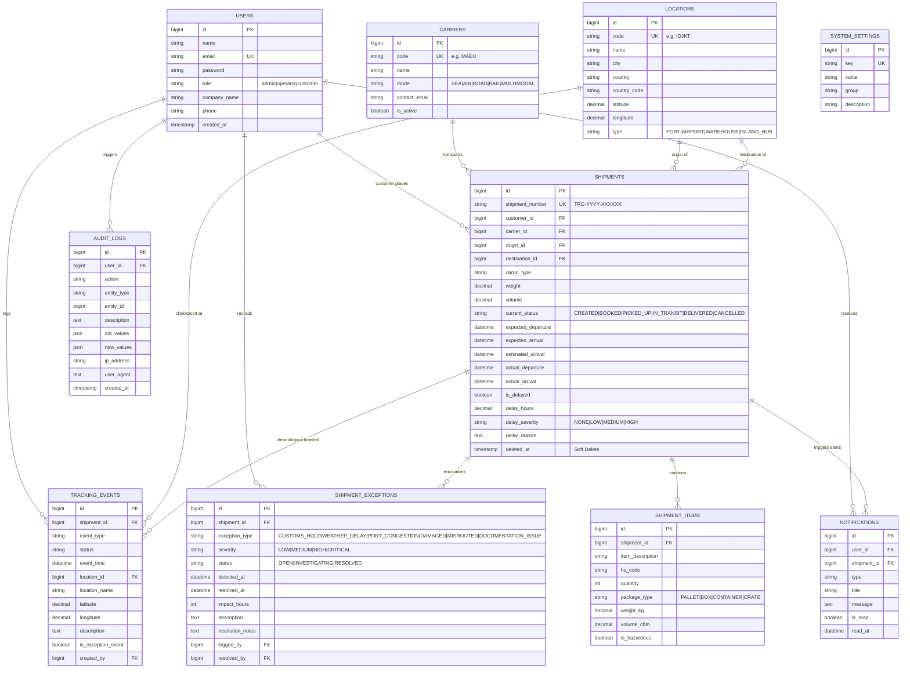

# CargoTrace Entity-Relationship Diagram (ERD) & Data Dictionary

## 1. Relational ERD (Mermaid)

```mermaid
erDiagram
    USERS ||--o{ SHIPMENTS : "customer places"
    USERS ||--o{ NOTIFICATIONS : "receives"
    USERS ||--o{ TRACKING_EVENTS : "logs"
    USERS ||--o{ SHIPMENT_EXCEPTIONS : "records"
    USERS ||--o{ AUDIT_LOGS : "triggers"

    CARRIERS ||--o{ SHIPMENTS : "transports"
    LOCATIONS ||--o{ SHIPMENTS : "origin of"
    LOCATIONS ||--o{ SHIPMENTS : "destination of"
    LOCATIONS ||--o{ TRACKING_EVENTS : "checkpoint at"

    SHIPMENTS ||--o{ SHIPMENT_ITEMS : "contains"
    SHIPMENTS ||--o{ TRACKING_EVENTS : "chronological timeline"
    SHIPMENTS ||--o{ SHIPMENT_EXCEPTIONS : "encounters"
    SHIPMENTS ||--o{ NOTIFICATIONS : "triggers alerts"

    USERS {
        bigint id PK
        string name
        string email UK
        string password
        string role "admin|operator|customer"
        string company_name
        string phone
        timestamp created_at
    }

    CARRIERS {
        bigint id PK
        string code UK "e.g. MAEU"
        string name
        string mode "SEA|AIR|ROAD|RAIL|MULTIMODAL"
        string contact_email
        boolean is_active
    }

    LOCATIONS {
        bigint id PK
        string code UK "e.g. IDJKT"
        string name
        string city
        string country
        string country_code
        decimal latitude
        decimal longitude
        string type "PORT|AIRPORT|WAREHOUSE|INLAND_HUB"
    }

    SHIPMENTS {
        bigint id PK
        string shipment_number UK "TRC-YYYY-XXXXXX"
        bigint customer_id FK
        bigint carrier_id FK
        bigint origin_id FK
        bigint destination_id FK
        string cargo_type
        decimal weight
        decimal volume
        string current_status "CREATED|BOOKED|PICKED_UP|IN_TRANSIT|DELIVERED|CANCELLED"
        datetime expected_departure
        datetime expected_arrival
        datetime estimated_arrival
        datetime actual_departure
        datetime actual_arrival
        boolean is_delayed
        decimal delay_hours
        string delay_severity "NONE|LOW|MEDIUM|HIGH"
        text delay_reason
        timestamp deleted_at "Soft Delete"
    }

    SHIPMENT_ITEMS {
        bigint id PK
        bigint shipment_id FK
        string item_description
        string hs_code
        int quantity
        string package_type "PALLET|BOX|CONTAINER|CRATE"
        decimal weight_kg
        decimal volume_cbm
        boolean is_hazardous
    }

    TRACKING_EVENTS {
        bigint id PK
        bigint shipment_id FK
        string event_type
        string status
        datetime event_time
        bigint location_id FK
        string location_name
        decimal latitude
        decimal longitude
        text description
        boolean is_exception_event
        bigint created_by FK
    }

    SHIPMENT_EXCEPTIONS {
        bigint id PK
        bigint shipment_id FK
        string exception_type "CUSTOMS_HOLD|WEATHER_DELAY|PORT_CONGESTION|DAMAGED|MISROUTED|DOCUMENTATION_ISSUE"
        string severity "LOW|MEDIUM|HIGH|CRITICAL"
        string status "OPEN|INVESTIGATING|RESOLVED"
        datetime detected_at
        datetime resolved_at
        int impact_hours
        text description
        text resolution_notes
        bigint logged_by FK
        bigint resolved_by FK
    }

    SYSTEM_SETTINGS {
        bigint id PK
        string key UK
        string value
        string group
        string description
    }

    NOTIFICATIONS {
        bigint id PK
        bigint user_id FK
        bigint shipment_id FK
        string type
        string title
        text message
        boolean is_read
        datetime read_at
    }

    AUDIT_LOGS {
        bigint id PK
        bigint user_id FK
        string action
        string entity_type
        bigint entity_id
        text description
        json old_values
        json new_values
        string ip_address
        text user_agent
        timestamp created_at
    }
```
